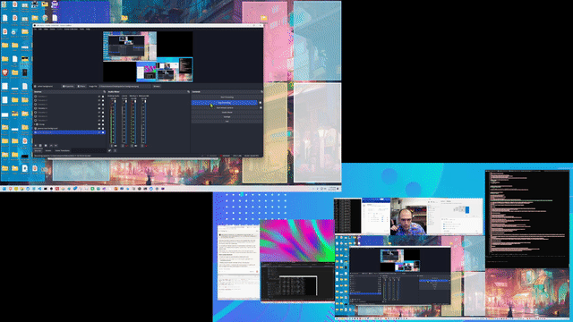

# ScreenSwitcher

Automatic OBS video source switcher for multi-monitor setups. Tracks your mouse and shows only the monitor you're currently on.



## Setup

**Prerequisites:** Windows, .NET 8, OBS Studio

### 1. Enable OBS WebSocket
- OBS > Tools > WebSocket Server Settings
- Enable server, note the password

### 2. Create Toggle Sources in OBS
- Add Display Capture sources for each monitor
- Name them: `T-Monitor-1`, `T-Monitor-2`, `T-Monitor-3`, etc.
- Use Windows Settings > Display > "Identify" to find your monitor numbers
- The "T-" prefix stands for "Toggle" (no pun intended with monitor/moniker!)

### 3. Configure Password
- Create `obs-password.txt` in project root
- Paste your OBS WebSocket password

### 4. Run
```bash
dotnet run
```

Or build standalone:
```bash
dotnet publish -c Release -r win-x64 --self-contained
```

## How It Works

Uses Windows API to track mouse position, maps to display numbers via `EnumDisplayDevices`, and toggles OBS sources via WebSocket.

---

**Vibe coded in 2 hours with [Claude Code](https://claude.com/claude-code)** 
